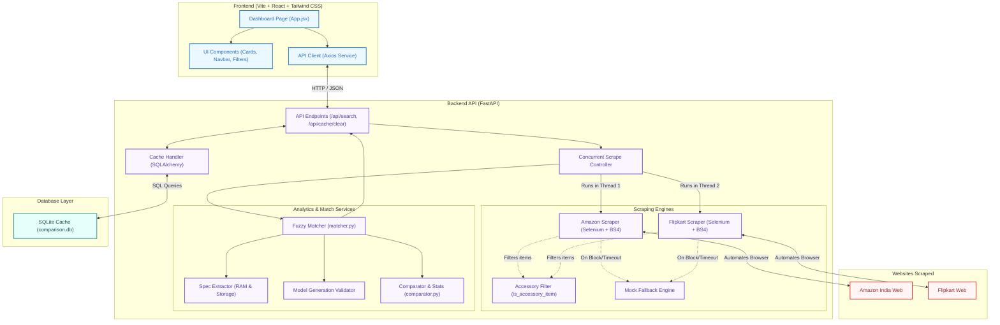
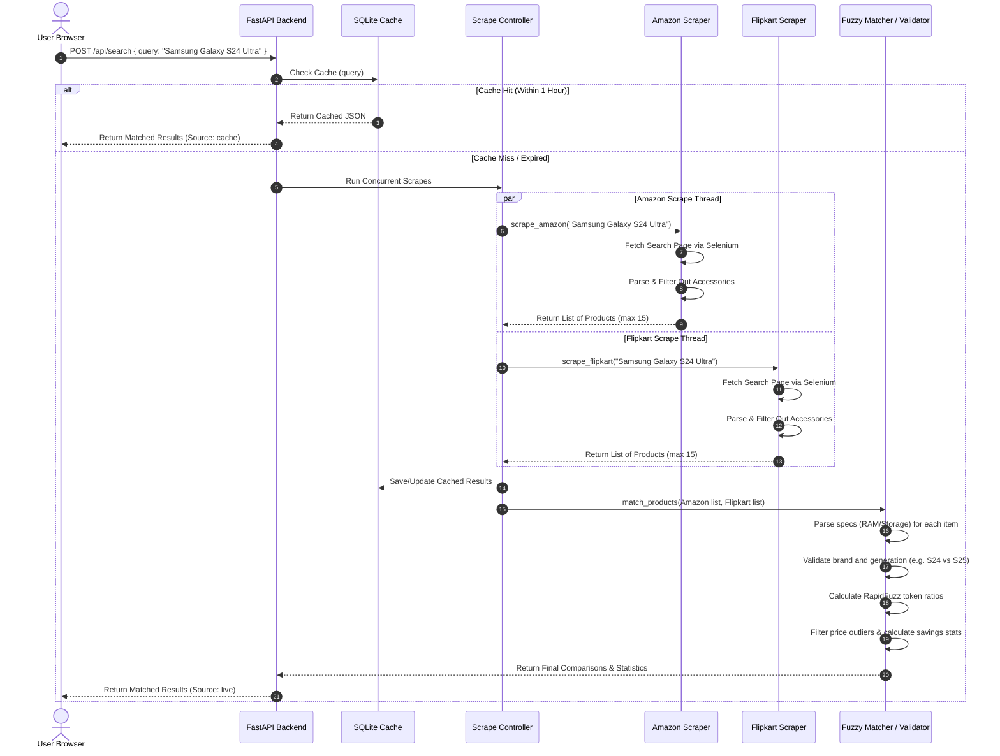

# Project Architecture & Data Flow

This document details the architecture design and data flow of the real-time Price Comparison Web Application.

---

## 1. System Components & Layers

The diagram below maps the components of the platform. It uses light, high-contrast backgrounds with dark borders and text to ensure absolute readability in all viewer themes (dark or light mode).

---

## 2. Real-Time Data Flow (Search Sequence)

The sequence diagram below displays what happens step-by-step when a user inputs a query (e.g., `"Samsung Galaxy S24 Ultra"`):

# Project Architecture & Data Flow

This document details the architecture design and data flow of the real-time Price Comparison Web Application.

---

## 1. System Components & Layers

The diagram below maps the components of the platform. It uses light, high-contrast backgrounds with dark borders and text to ensure absolute readability in all viewer themes (dark or light mode).

---

## 2. Real-Time Data Flow (Search Sequence)

The sequence diagram below displays what happens step-by-step when a user inputs a query (e.g., `"Samsung Galaxy S24 Ultra"`):

